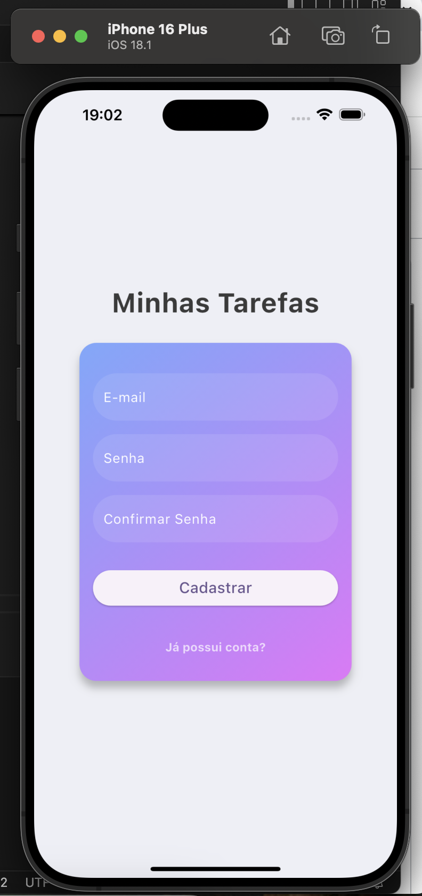
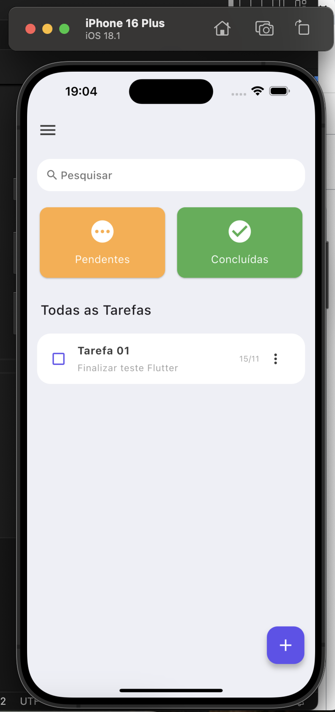

# todo-list

Este é um aplicativo de lista de tarefas desenvolvido em Flutter, permitindo que usuários criem, editem, excluam e alterem o status de suas próprias tarefas (pendente ou concluída). O aplicativo utiliza autenticação com token para garantir que apenas o usuário autenticado possa acessar e manipular suas tarefas. Inclui sincronização em tempo real das tarefas e suporte à localização pt_BR para formatação de datas.

<div style="display: flex; justify-content: space-between;">
  
 
</div>


### Arquitetura e Design
O aplicativo segue o padrão MVVM (Model-View-ViewModel) e faz uso do Provider para gerenciar o estado, proporcionando uma estrutura modular e fácil de manter.

- Autenticação com Firebase: Usamos o Firebase Authentication para gerenciar usuários de forma segura.
- Banco de Dados Firebase Realtime Database: Armazenamento das tarefas dos usuários, oferecendo persistência de dados e atualização em tempo real.
- Gerenciamento de Estado com Provider: Gerencia o estado da lista de tarefas e fornece uma experiência de sincronização em tempo real.
- Componentização: Interface dividida em componentes reutilizáveis, como TaskItem, TaskForm e TaskListPage, para facilitar a manutenção.
- Navegação: A navegação entre telas (Home, TaskListPage) é feita usando Navigator, com uma experiência de usuário fluida.

### Melhorias Futuras
- Renovação Automática de Sessão: Implementar renovação automática de token no Firebase.
- Notificações Push: Enviar notificações para tarefas com prazo.
- Suporte Offline com Sincronização: Usar armazenamento local para acesso offline e sincronização posterior.
- Filtros Avançados e Ordenação: Adicionar filtros de prioridade, prazos, e ordenação de tarefas.
- Testes Automatizados: Adicionar cobertura de testes para validação e qualidade do código.
- Gerenciamento de Estado: MobX.

### Requisitos
- Flutter SDK: Versão 3.x ou superior
- Dart: Versão 2.17 ou superior
- Dependências do Projeto: Listadas no pubspec.yaml

### Instruções de Configuração e Execução
1. Clone o Repositório:

```bash
git clone https://github.com/taisbronca/todo-list
cd todo
```
2. Instale as Dependências: Execute o comando abaixo para instalar todas as dependências listadas no pubspec.yaml:
```bash
flutter pub get
```

3. Configuração do Firebase:

- Acesse o Console do Firebase e crie um novo projeto.
- No painel do Firebase, navegue até Build > Realtime Database e clique em "Criar Banco de Dados". Siga as instruções para configurar o Realtime Database.
- Ainda no painel do Firebase, vá até Authentication e habilite o provedor de e-mail/senha para permitir a autenticação de usuários.

4. Execute o Projeto: 
- Com o Firebase configurado e as dependências instaladas, você pode executar o aplicativo em um dispositivo emulador ou físico:
```bash
flutter run
```

5. Configuração de Segurança (Opcional, mas Recomendado):

No Console do Firebase, em Realtime Database > Regras, defina regras de acesso apropriadas para garantir a segurança dos dados. Por exemplo, para permitir que apenas usuários autenticados leiam e gravem dados, você pode configurar as regras como:
```json
{
  "rules": {
    ".read": "auth != null",
    ".write": "auth != null"
  }
}
```

- [Lab: Write your first Flutter app](https://docs.flutter.dev/get-started/codelab)
- [Cookbook: Useful Flutter samples](https://docs.flutter.dev/cookbook)

For help getting started with Flutter development, view the
[online documentation](https://docs.flutter.dev/), which offers tutorials,
samples, guidance on mobile development, and a full API reference.

###### tags: `flutter` `dart` `mobile` `firebase`
